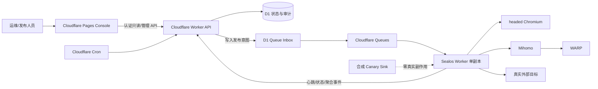
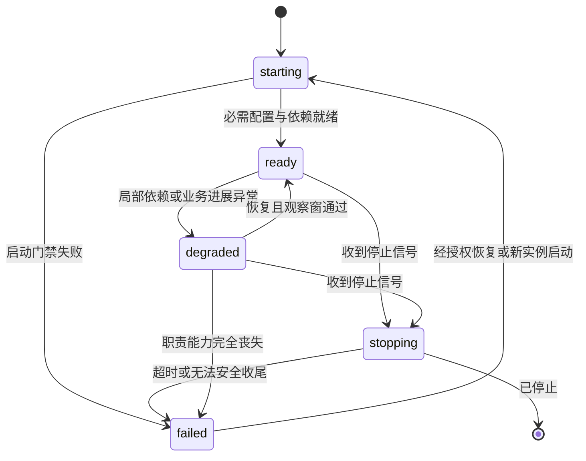
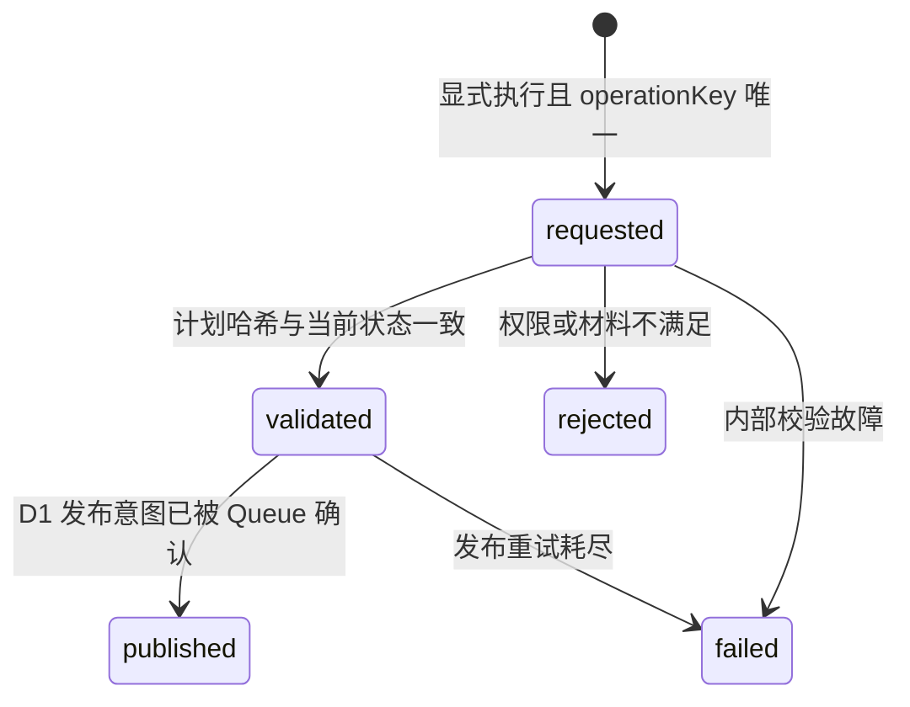

# 生产运维就绪改进技术设计

## 文档信息

| 项目 | 内容 |
| --- | --- |
| 状态 | 技术设计已确认 |
| 版本 | 1.2 |
| 日期 | 2026-08-03 |
| 读者 | 开发、验收、发布与生产运维人员 |
| 范围 | OpenSpec change `improve-production-operations-readiness` |
| 唯一需求输入 | `requirements.md` 1.2 |
| 维护入口 | 本文件；需求变化先更新 `requirements.md` 并重新完成设计门禁 |
| 关联决定 | ADR-0004 混合运行时、ADR-0005 D1 暂存 Cloudflare Queues、ADR-0006 WARP 出站 sidecar |

## 关联需求

本轮隔离状态恢复设计直接关联 `REQ-019`、`REQ-P2-004`、`NFR-002`、`NFR-003`、`NFR-005` 与 `AC-018`；既有隔离回滚设计与其它需求继续沿用本文追踪矩阵。

## 背景、目标与非目标

当前系统已采用 Cloudflare Pages Console、Cloudflare Worker API、D1、Queues、Cron，以及 Sealos 单副本 headed Chromium Worker、Mihomo、WARP。现有任务租约、幂等 effect、恢复信封、DLQ、逐条重放、结构化事件与心跳是本设计的基础，不重写业务语义。

本设计把当前“可访问”提升为可分域诊断、可度量、可安全恢复、可重复发布，并为单副本建立容量和恢复边界。设计不改变公开 API、采集源、分发目标、限速、文章提取顺序、归档格式或去重结果；不增加 Worker 副本，不引入外部 APM、Cloudflare Access 或服务网格，不执行生产删除、重放、部署或回滚。

## 当前架构与约束

- Cloudflare API 是控制面和唯一公网服务端入口；Console 不直接访问 D1、Queues 或 Sealos。
- D1 持有任务、租约、幂等 effect、恢复信封、DLQ、重放审计、心跳及运维聚合数据；Cloudflare Queues 只负责至少一次投递，不是真实状态源。
- Sealos Worker 执行采集、浏览器提取、分发和归档；Mihomo 提供路由，WARP 提供出站网络能力，浏览器与代理状态均可能独立失败。
- Worker 保持 `replicas: 1`。PVC 上的浏览器、WARP 和归档相关状态不能据此推定可并发共享。
- D1 与 Queues 不存在跨系统原子提交；所有发布任务必须先在 D1 形成可重试的意图，再由现有暂存/发布链投递。
- 最终 SLO、错误预算、保留期、告警渠道和生产 RPO 需等待 14 天基线或专项批准；批准前仅作为候选参数，不驱动破坏性动作。
- 当前未授权浏览器自动化 E2E；本设计只定义后续授权后的验收入口。

## 方案总览

依赖方向固定为 Console → API → D1/Queues，Queues → Worker → 浏览器/代理/外部目标。Worker 不承担运维策略审批，Console 不持有服务令牌，Cloudflare 不承担 headed 浏览器或持久登录态执行。

## 组件职责与数据所有权

| 组件 | 职责 | 不负责 |
| --- | --- | --- |
| Console | 展示分层状态、趋势、阈值、证据；提交显式确认 | 保存长期管理凭据、展示 payload |
| API | 鉴权、只读聚合、运维计划校验、审计、告警编排 | 浏览器任务、绕过 D1 直接批量重放 |
| D1 | 运维事实、任务状态、指标桶、审计与发布意图 | 网络投递成功的推定 |
| Queues | 至少一次传输已获准任务 | 业务状态、审计和幂等真相 |
| Worker | 能力探测、领取决策、任务执行、结算、心跳 | SLO 审批、自动扩容 |
| Browser | DOM/登录态相关采集与回退 | Worker 进程健康 |
| Mihomo/WARP | 路由与出站能力 | 任务状态和业务重试策略 |

## 详细设计

以下状态机、接口、数据、发布、隔离演练、迁移和可观测性章节共同构成本 change 的详细设计；本轮实现仅进入 `DES-019` 明确的隔离状态恢复范围。

## 健康状态机

所有失效域统一使用 `starting | ready | degraded | stopping | failed`，但分别计算。状态快照契约为：

| 字段 | 约束 |
| --- | --- |
| `component` | `console | api | worker | browser | mihomo | warp` |
| `state` | 五态枚举 |
| `reasonCode` | 稳定低基数代码，不含异常原文和敏感值 |
| `observedAt` / `expiresAt` | RFC 3339；过期快照不得显示为 `ready` |
| `deploymentVersion` | 源码提交、Cloudflare version 或镜像 digest 的非敏感标识 |
| `canAcceptWork` | 当前能否领取该能力所需的新任务 |

liveness 只读取独立健康服务的内存快照，不等待浏览器、网络、D1 或当前任务；readiness 由配置有效性、停止标志、依赖状态、心跳/进展新鲜度和任务领取能力共同计算。浏览器、Mihomo 或 WARP 失败时，纯函数 `acceptance decision` 按任务能力需求返回 `accept | defer | reject`；依赖任务不得新领取，已领取任务只能安全完成、延期或释放租约。

## 运维接口契约

现有公开路径保持不变，新增接口位于既有管理认证边界内：

| 方法与资源 | 权限 | 语义 |
| --- | --- | --- |
| `GET /operations/health/components` | 只读 | 六个组件状态、原因、时间、版本 |
| `GET /operations/queue/summary` | 只读 | 可执行/处理中/延迟/不可执行数量、最老年龄、最早恢复时间 |
| `GET /operations/metrics` | 只读 | 当前值、窗口趋势、候选或已批准阈值、采集时间、版本 |
| `GET /operations/dlq/consistency` | 只读 | 逻辑冻结时间、分类明细、计数、摘要、未解释数 |
| `POST /operations/replays/plan` | 管理 | 零写入 dry-run，返回逐条判定和 `planHash` |
| `POST /operations/replays/execute` | 管理+显式确认 | 仅执行同对象、同参数和同 `planHash` 的计划 |
| `GET /operations/replays/{operationId}` | 只读 | 返回重放状态和审计主体 |
| `GET /operations/retention/report` | 只读 | 候选清理范围、风险和前后摘要，不删除 |

所有响应使用稳定 `requestId`，错误统一区分 `unauthenticated`、`forbidden`、`stale_plan`、`invalid_material`、`idempotency_conflict`、`rate_limited`、`dependency_unready` 与 `internal_error`。错误不得回传凭据、payload、真实 URL、标题或恢复信封。

## DLQ 一致性与安全重放

一致性报告以调用时 `freezeAt` 为逻辑截止点，在一个只读查询计划中关联 DLQ、dead job、恢复信封和重放记录。每条记录必须且只能进入 `matched`、`historical_migration`、`orphan_dlq`、`dead_without_dlq`、`already_replayed`、`missing_envelope` 或 `integrity_anomaly`；其中异常类别仍是“已分类但未解决”，`unexplainedCount` 必须为 0。报告包含分类计数、稳定 ID 摘要和查询前后只读摘要，不修改数据。

重放计划逐条检查对象版本、信封完整性、effect/幂等状态、目标副作用状态、租约、当前限速、依赖健康和调用权限。`planHash` 由规范化对象 ID、参数、快照版本和判定结果生成；实际执行若任一输入或快照变化则返回 `stale_plan`，要求重新 dry-run。

`operationKey` 唯一约束保证重复请求复用原操作。执行事务先写审计及 D1 queue inbox，再由既有发布器投递 Cloudflare Queue；投递至少一次，最终副作用仍由 job/effect key 幂等。禁止 API 在审计之外直接向 Queue 发布，禁止批量请求绕过逐条判定。

## 指标、SLI 与 SLO 数据模型

指标按分钟/小时窗口聚合，维度仅允许 `service`、`component`、`itemKind`、`source`、`destination`、`outcome`、`extractionPath`、`deploymentVersion`；任务和租约 ID 只用于事件关联，不作为指标标签。

| SLI | 计算依据 |
| --- | --- |
| API 可用性 | 窗口内成功请求数 / 有效请求数 |
| Worker 心跳新鲜度 | 心跳年龄及窗口内满足阈值的比例 |
| 最老可执行任务年龄 | `available_at <= now` 且可领取任务的最大年龄 |
| 任务结果 | 完成、延期、重试、死信的计数与成功率 |
| 提取路径 | direct、short-rejected、browser-fallback 的结果与耗时 |
| 依赖状态 | browser、mihomo、warp 各状态持续时间比例 |
| 容量/成本 | CPU、内存、重启、P50/P95、到达率、消化率、D1/日志用量与月成本 |

指标点至少含 `metricKey`、窗口起止、聚合值、样本数、维度、采集时间和部署版本。SLO policy 另存 `candidate | approved | retired` 状态、窗口、目标、错误预算和批准证据摘要。连续 14 天前只允许 `candidate`。

Cloudflare scheduled handler 在现有指标采集边界内每日计算一次 7/30/90 天候选保留窗口，并按 `(sampleDate, recordKind, windowDays)` 唯一键 upsert 聚合样本。样本仅含 `sampleDate`、`recordKind`、`windowDays`、`cutoffAt`、候选记录数、最早命中时间、`capturedAt` 和 `deploymentVersion`，不保存任务 payload、正文、真实 URL/标题、凭据或通知内容。重复或并发 Cron 复用同一日键并覆盖同一聚合行；处理中断时不把该日标记为完整，下一次调度只需重算并 upsert 缺失或未完成的同键样本，不产生重复样本，也不触发删除。该采集使用独立失败边界，不更新任务状态、租约或 Queue 发布意图；采集失败只留下脱敏失败证据并等待下次调度，不阻塞或改变主采集与任务处理。

候选阈值状态集合为 `无状态 | pending | firing | recovered`：首次越界进入 `pending`，满足候选持续窗口后进入 `firing`，曾进入 `firing` 的实例恢复后进入 `recovered`，恢复审计完成后回到无状态；`pending` 在持续窗口前恢复则直接回到无状态。当前阶段只持久化状态转换审计并写脱敏稳定事件，不新增通知投递状态，不调用外部通知渠道，也不得把 `firing` 或 `recovered` 计为通知已送达。外部告警及恢复通知继续由 `OPEN-001`、相关 `AUTH-*` 和渠道批准门禁阻断。

以上 scheduled capture 与候选告警状态仅新增内部运维数据写入，不新增或修改公开 API、Queue 消息、任务信封及任务处理器契约。

## 发布与回滚 CLI

唯一发布入口为基于 CAC 的 TypeScript CLI，消费不可变 release manifest。业务输入包含源码提交、Console/API 目标版本、migration 集、Worker/Mihomo/WARP digest、Sealos revision、Secret 引用版本、备份标识、canary 集和退出门槛；manifest 只保存引用与摘要，不保存 Secret。

CLI 提供 `plan`、`apply`、`rollback` 三类动作，`apply` 与 `rollback` 均支持 `--dry-run`。dry-run 与实际执行读取同一 manifest 并生成同一 `planHash`；实际写入还必须显式提供该哈希确认。dry-run 仅做只读解析、权限探测、版本/摘要核对、migration 兼容检查、备份可恢复性检查和目标差异输出，不部署、不迁移、不回滚、不发送生产 canary。

执行顺序固定为：全部预检 → 备份证据 → expand migration → API → Console → Worker → 隔离 canary → 稳定窗口。任何预检失败时线上版本和数据零变化；执行中失败则停止后续单元，根据步骤日志恢复已改变单元到上一版本，并验证 D1 双版本兼容、健康、错误率、积压和合成关键流程。证据记录每步 `planned | started | succeeded | failed | compensated`、开始/结束时间、版本摘要和脱敏验证结果，支持中断后从最近已确认步骤恢复，不重复成功步骤。

## 隔离旧 Docker Compose 回滚演练

### DES-018：独立 rehearsal 动作与强隔离执行器

为满足 `REQ-018`，在既有 `@inbox/release-operations` CAC CLI 中新增独立 `rehearse-legacy` 动作，不复用会调用生产 `wrangler`、`kubectl` 的 `rollback` 执行路径。该动作消费单独的 rehearsal manifest；manifest 只包含 `schemaVersion`、唯一 `runId`、源码提交、合成备份标识及摘要、上一 Cloudflare API version、上一 Console commit、Worker/Mihomo/WARP 三个不可变镜像摘要、D1 migration 清单和固定演练资产路径，不接受任意命令、生产 Secret、生产 context、远端数据库名或外部目标。

计划生成器是纯函数，规范化 manifest 后输出稳定 `planHash` 与以下固定阶段：

1. `isolation-preflight`：拒绝非 `inbox-rehearsal-*` 项目名、仓库外路径、host bind、host port、外部网络、启用的 source/destination、可变镜像标签及敏感原值。
2. `identity-evidence`：核对源码提交、合成备份摘要、上一 Cloudflare 版本和三个上一镜像摘要，仅生成证据，不调用 Cloudflare、Sealos 或 registry 写接口。
3. `d1-compatibility`：在临时 SQLite/D1 目录依序应用完整 migration，执行旧 Worker 写入/读取契约并重复应用最新 expand migration；禁止 `--remote`。
4. `substitute-worker-stop`：只停止同一临时 Compose project 内的替身新 Worker，记录停止开始时间；不得解析或接受生产 workload 名。
5. `legacy-compose-restore`：使用固定 `deploy/rehearsal/compose.yml`、内部网络、临时命名卷和全禁用 `channels.yaml` 构建并启动旧 server/worker 路径，等待既有容器 healthcheck。
6. `reconciliation`：核对 server、worker、PostgreSQL、Redis 健康，旧 Worker 心跳、合成记录数/稳定标识和真实外部调用计数 0，并计算从替身停止到旧 Worker 健康的 RTO。
7. `cleanup`：无论前序成功或失败，均执行同一项目的 `down --volumes --remove-orphans`，并确认同名前缀容器、网络和卷残留数为 0。

dry-run 只解析并输出计划证据，命令执行数必须为 0；实际演练必须显式提供同一 `planHash`。执行器只允许参数化进程调用，不经 shell 拼接；任何阶段失败立即停止业务阶段，在 `finally` 中执行精确 cleanup，并以 `operations.rollback_rehearsal.step_failed` 或 `operations.rollback_rehearsal.completed` 记录脱敏结果。证据包含 `runId`、阶段、时间、不可变版本摘要、健康、对账、RTO、清理结果和敏感扫描结论，不包含命令环境、Secret、用户数据或业务内容。

固定演练 Compose 复用仓库 Dockerfile 和旧进程入口，但不复用生产 `.env`、`channels.yaml`、`${HOME}/.agents`、命名卷、网络或端口：所有 source、destination、通知和文章归档均禁用；运行时网络为 `internal: true`，不发布 host port，不挂载用户目录。替身新 Worker 只用于验证停止边界，不连接 D1、Cloudflare Queues 或真实目标。

D1 双版本兼容以迁移契约测试为事实源：完整 migration 后旧 Worker 仍能按既有字段写入，新增 expand 表不要求旧版本提供字段；演练不执行 down migration。Cloudflare version、Console commit 和镜像摘要只验证格式、固定性及证据一致性，不执行真实回退。

该设计不改变生产发布 manifest、`rollback` 命令、公开 API、D1 schema 或 Sealos 资源，属于可删除的隔离验证能力，无需新增 ADR。代价是不能证明真实平台控制面权限和网络恢复，只证明恢复材料、旧运行路径、跨版本数据契约与编排顺序；真实生产回滚仍需单独授权。

## 隔离三类状态备份恢复演练

### DES-019：固定合成快照与零生产可达的恢复执行器

为满足 `REQ-019`，在 `@inbox/release-operations` CAC CLI 新增独立 `rehearse-state-restore` 动作。该动作不复用 `apply`、`rollback` 或 `rehearse-legacy` 的外部命令路径，不调用 `kubectl`、`wrangler`、Sealos、Cloudflare、registry、浏览器或网络；只读取仓库内固定合成快照并写入操作系统临时目录。

状态恢复 manifest 只接受以下固定字段：`schemaVersion=1`、唯一 `runId`、源码提交、`capturedAt`、候选 RPO 秒数 `86400`、`rpoStatus=unapproved`，以及 Worker、浏览器、WARP 三类快照的固定仓库相对路径、快照 ID、schema、文件数、稳定标识和 SHA-256。任何额外字段、仓库外路径、绝对路径、可变命令、生产资源名、Secret、URL 或业务内容均拒绝。规范化 manifest 后由纯函数生成稳定 `planHash`。

固定阶段如下：

1. `snapshot-preflight`：确认三类状态恰好各一份、路径为允许的固定 JSON、源文件是普通文件且非符号链接，文件大小受限，摘要/schema/状态类别/稳定标识/记录数一致；失败时尚未创建恢复目录。
2. `restore`：在唯一 `inbox-state-restore-<runId>-*` 临时目录下创建三类隔离根目录，以 `0600` 写入已验证字节；不保留源路径权限和所有权，不覆盖既有目录。
3. `startup-gate`：从恢复目录重新读取并按与预检相同的严格 schema 校验，三类状态全部 `ready` 才允许继续；这是合成启动门禁，不宣称真实 Worker、Chromium 或 WARP 进程已启动。
4. `reconciliation`：比较源与恢复后的 SHA-256、schema、文件数、稳定标识和记录数，计算从恢复开始到门禁通过的 RTO，以及从 `capturedAt` 到恢复开始的候选 RPO；候选 RPO 不超过 24 小时只记为 `candidate_verified`，生产状态始终保留 `unapproved`。
5. `cleanup`：无论成功或失败均删除唯一临时目录并读回不存在；证据记录真实外部调用、生产资源变更、敏感命中与临时残留均为 0。

dry-run 只解析 manifest、输出阶段计划和同一 `planHash`，文件读取数、目录创建数与写入数均为 0；实际演练必须显式提供该哈希。执行器使用 Node 文件系统结构化 API，不经 shell，不跟随符号链接，不接受任意目标路径。证据使用稳定事件 `operations.state_restore_rehearsal.planned|step_completed|step_failed|completed|failed|cleanup_completed`，包含 `traceId=TC-002`、三类不可逆摘要、RTO、候选 RPO 判定、对账和清理结果，不包含文件内容、真实路径、凭据或用户数据。

仓库固定快照只表达三类数据契约：Worker 持久游标/归档元数据、浏览器 storage-state 等价结构、WARP 注册状态等价结构；全部使用合成标识和空敏感集合。该能力证明恢复编排、完整性门禁与候选日备份窗口，不证明 Sealos PVC 快照 API、真实浏览器登录态、真实 WARP 重新注册或生产 RPO，因此不改变 `OPEN-004`，也无需新增 ADR。

## 数据保留、备份与恢复

- 保留报告覆盖心跳、完成任务、任务信封、DLQ、重放审计和幂等 effect；初始 7/30/90 天仅为候选。
- 每日候选聚合样本只用于 retention dry-run 证据；同一日重复 Cron 必须得到相同唯一键和可覆盖结果，部分写入可由后续调度安全补齐。
- 未批准期限前不提供生产删除执行；批准后清理仍需同参数 dry-run 连续 14 天、显式确认、分批游标、可中断恢复和前后对账。
- 保留期不得短于最长重试、幂等保护、审计、备份和争议处理窗口；禁止无条件清表与长事务全表删除。
- D1 备份记录平台快照/导出标识、schema version、表计数与稳定摘要；Worker、浏览器和 WARP 状态使用 Sealos PVC 快照或等价备份，Secret 仅备份版本引用。
- 恢复只先在隔离环境进行，使用合成数据或脱敏元数据，核对 schema、记录数/稳定 ID、启动门禁与关键流程；RTO 目标为 15 分钟，RPO 在批准前不宣告达成。
- 旧 Python 运行时、旧 Docker 数据和部署资产在回滚窗口、备份恢复与删除授权均满足前保持零删除、零改写。

## 数据迁移与兼容回滚

本 change 的 D1 migration 仅允许 expand：新增候选保留聚合、候选阈值审计所需的新表和索引，新增字段必须可空或具备不改变旧行为的默认值；禁止删除、重命名、收紧非空约束、改写旧数据或执行 contract。迁移必须可重复判定为已应用，旧版本应用忽略新结构，新版本不得依赖旧版本无法写出的必填数据。

健康、指标和重放接口均为新增管理契约；现有字段与路径保持可读。若阶段退出门槛失败，只停用 scheduled capture 和候选阈值读取/写入路径并回退应用版本，保留新增表、索引及已写入的向后兼容运维数据；不执行 down migration。后续如需删除新结构，必须另立经批准的 contract 变更，不与本 change 的实现或回滚绑定。

## 可观测性与安全

关键事件使用 `<领域>.<动作>.<结果>`，含中文描述、`service`、部署版本、不可逆关联 ID、任务/租约类型、来源/目标类别、结果与耗时。状态转换、领取拒绝、重放、发布、回滚、备份、恢复、清理和候选阈值均有稳定事件；领域纯函数不记录日志，由最近 IO/编排边界记录。候选阈值固定使用 `operations.alert_candidate.pending`、`operations.alert_candidate.firing`、`operations.alert_candidate.recovered`，仅携带低基数 `policyKey`、聚合窗口、脱敏关联键和结果，不记录渠道地址、收件人、阈值原始查询、任务标识或业务内容；没有通过 `OPEN-001` 和相关 `AUTH-*` 门禁时不得产生任何外部通知调用、投递回执或“已通知”事件。

管理、Worker 服务身份和只读身份分离。所有写操作认证、授权、显式确认并记录审计主体。API Key、服务令牌、Cookie、storage state、加密密钥、文章正文、真实 URL/标题和通知内容禁止进入日志、指标、告警、Console、发布证据和构建产物。所有验证产物执行敏感哨兵扫描，命中必须为 0。

canary 使用固定合成 fixture、显式 canary 标识、隔离存储和无副作用 destination sink，覆盖入队、领取、direct、短内容拒绝、浏览器回退、归档模拟和结算；真实 Cubox、Flomo、坚果云和文章仓库调用必须为 0。

## 发布阶段与停止条件

| 阶段 | 交付 | 停止条件 |
| --- | --- | --- |
| P0 | 分层健康、队列年龄、DLQ 报告、隔离 canary、回滚演练 | 探针超时、未解释差异、真实副作用或恢复超过 15 分钟 |
| P1 | 指标趋势、SLO/告警、重放审计、发布 CLI、保留报告 | 敏感命中、门禁可绕过、告警不可关联或 dry-run/执行计划不一致 |
| P2 | 容量成本、备份恢复、多副本决策证据 | RPO 未批准、并发安全未通过或试图自动扩容 |

## 验证策略

| 层级 | 职责 |
| --- | --- |
| 单元 | 状态转换、领取决策、SLI 聚合、候选阈值四态转换、每日样本唯一键/截止时间、planHash、保留选择、发布/回滚计划纯函数 |
| 集成 | D1 expand-only migration、旧版本读取兼容、每日样本同键 upsert、重复/并发 Cron、部分写入中断后重跑、采集失败不影响主采集/任务处理、冻结一致性查询、唯一操作键、queue inbox、指标窗口 |
| 隔离回滚 | rehearsal manifest fail-closed、dry-run 零命令、同一 planHash 确认、临时 Compose 停替身/起旧路径、D1 双版本契约、RTO、真实外部调用为 0、失败后资源残留为 0 |
| 隔离状态恢复 | 三类固定快照 fail-closed、dry-run 零 IO、同一 planHash 确认、路径/符号链接/摘要拒绝、临时恢复、启动门禁、RTO、候选 RPO、对账与失败清理 |
| 契约 | 运维 API 鉴权、错误语义、过期状态、候选期外部通知调用为 0、同参数 dry-run/execute、旧公开 API 不变 |
| 组件 | 独立健康服务在长浏览器任务下响应；Mihomo/WARP 故障时领取隔离 |
| 端到端 | 本 change 不运行自动化 E2E；隔离 canary、外部告警/恢复、真实发布失败停止、生产版本回退和备份恢复均须另行授权 |
| 运行时证据 | 24 小时零探针超时、14 天脱敏基线、RTO、对账摘要、版本和敏感扫描 |

当前不运行浏览器自动化 E2E，也不执行生产重放、清理、发布、回滚或删除。验收设计应以替身依赖和隔离环境覆盖自动化，并把需要单独授权的线上步骤列为人工门禁。

## 备选方案与权衡

本轮没有选择 Sealos PVC 或真实状态副本，因为当前任务没有生产数据复制和生产恢复授权；没有选择 tar/shell 管道，因为归档路径穿越、符号链接和权限语义会扩大攻击面；没有选择把状态恢复并入生产 `rollback` 或 `rehearse-legacy`，因为会引入不必要的控制面或 Docker 可达路径。固定 JSON 合成快照覆盖的格式有限，但能以最小依赖证明完整性、恢复顺序、RTO、候选 RPO 与失败清理。

既有隔离回滚仍保持独立 `rehearse-legacy` 动作：没有选择复用生产 `rollback` 执行器，因为即使使用合成 manifest，也会保留误调用 `wrangler`/`kubectl` 的风险；没有选择仓库外一次性 shell 脚本，因为它会复制 manifest 校验、planHash、证据和脱敏规则；没有选择真实生产回滚演练，因为当前任务没有生产部署或回滚授权。

1. **D1 为运维事实源，Queues 仅传输**：避免双写后无法判断发布结果；代价是增加 inbox 发布延迟与补偿状态。该决定延续 ADR-0005，无需新 ADR。
2. **健康快照与工作负载 IO 分离**：保证探针预算；代价是 liveness 不能单独证明业务进展，必须结合 readiness、心跳和 SLI。
3. **原生聚合优先于外部 APM**：减少依赖、费用和敏感治理；代价是跨域查询能力有限。若引入外部 APM，另立需求和 ADR。
4. **expand/contract 而非 down migration**：确保应用可回退；代价是旧结构需跨稳定窗口保留。
5. **继续单副本**：避免登录态、归档和外部副作用并发风险；代价是可用性受 RTO 上限约束。多副本只有完成 REQ-P2-003 并批准独立 ADR 后才可设计实施。

## 风险、假设与实施交接

- 指标增长可能增加 D1/日志成本：仅保留低基数桶并用月度成本趋势约束。
- 状态快照可能陈旧：所有读取必须校验 `expiresAt`，陈旧一律降级而非沿用 ready。
- D1/Queue 发布可能重复：以 operation key、queue inbox 和 effect key 三层幂等收敛。
- 清理可能破坏幂等与审计：最终期限未批准前保持报告-only。
- 实现人员须按 `tasks.md` 的 RED-GREEN-REFACTOR 顺序推进；接口、数据或边界变化必须回到最早受影响门禁。
- 实施前须对具体函数、路由与部署流程执行 GitNexus impact analysis；本文不授权生产操作或 Git 交付。

## 需求到设计追踪

| 需求 | 设计章节 |
| --- | --- |
| REQ-P0-001～003、NFR-001 | 健康状态机、组件职责、验证策略 |
| REQ-P0-004 | 运维接口、指标数据模型 |
| REQ-P0-005～007、REQ-P1-010 | DLQ 一致性与安全重放、权限边界 |
| REQ-P0-008、NFR-005 | 隔离 canary、验证策略 |
| REQ-P0-009、REQ-018、REQ-P1-005～007、NFR-002/005/006 | 发布与回滚 CLI、隔离旧 Docker Compose 回滚演练、迁移与兼容回滚 |
| REQ-P1-001～004、NFR-004/007 | 指标、SLI/SLO、可观测性 |
| REQ-P1-008 | 数据保留、备份与恢复 |
| REQ-P1-009、NFR-003 | 启动门禁、Secret 与敏感字段边界 |
| REQ-P2-001～003 | 容量成本、单副本决定与 ADR 门禁 |
| REQ-P2-004、REQ-019、NFR-002/003/005 | 数据保留、备份与恢复、隔离三类状态备份恢复演练、可观测性与安全 |
| REQ-P2-005 | 旧资产保留 |

## 待决策事项

- OPEN-001 告警渠道与责任人：只阻塞告警投递验收。
- OPEN-002 最终 SLO、错误预算和窗口：只阻塞阈值批准。
- OPEN-003 最终保留期限：只阻塞生产清理。
- OPEN-004 生产 RPO：只阻塞生产恢复目标判定。
- OPEN-005 多副本路线：只阻塞后续多副本 ADR 与实现，本变更保持单副本。
- OPEN-006 Cloudflare Access 或外部 APM：可选增强，若采用须另建需求与 ADR。

阻塞后续验收设计的待决策项：**无**。
